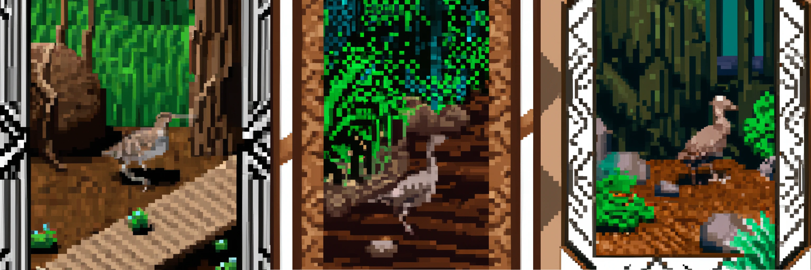

Woodcock KG Corpora Generation
===========================

**Objective:** Enable the generation of corpora for embedding techniques like
RDF2Vec from large knowledge graphs (e.g. Wikidata or DBpedia) using
consumer-grade hardware for enthusiasts, provided you have enough time on your
hand.

Under the category of enthusiast-level commodity hardware, we define the
specifications as:

- **Processor:** AMD Ryzen™ 9 5900 or Intel Core i9-10900K
- **Memory:** 64GB RAM
- **Storage:** 1 TB available on either HDD or SSD

Feedback and Contributions
--------------------------
We highly value your feedback and any contributions you might want to make. Your
insights and improvements can drive this project forward and benefit everyone
who uses it.

How to Provide Feedback:
^^^^^^^^^^^^^^^^^^^^^^^^

1. **Issues:** If you encounter any issues or bugs, please open a new issue on
our `GitHub Issues <https://github.com/khaller93/woodcock/issues>`_ page.
Describe the problem in detail so we can address it effectively.

2. **Suggestions:** If you have ideas for new features or improvements, feel
free to open a feature request issue. Clearly label it as an ``enhancement`` and
detail your idea so we can discuss it.

Contributing:
^^^^^^^^^^^^^

1. **Fork and Clone:** Start by forking the project and then cloning your fork
to make modifications.

2. **Branch:** Create a new branch for every feature or fix, this helps in
organizing and reviewing changes.

3. **Pull Request:** After making your changes, commit them and push them to
your fork. Then, open a pull request against our ``main`` branch.

4. **Stay Updated:** Make sure your fork is always up-to-date with our ``main``
branch to avoid merge conflicts.

Contact:
^^^^^^^^

- Kevin Haller - `contact@kevinhaller.dev <mailto:contact@kevinhaller.dev>`_

We truly appreciate every form of feedback and look forward to seeing your
suggestions, bug reports, and contributions!
